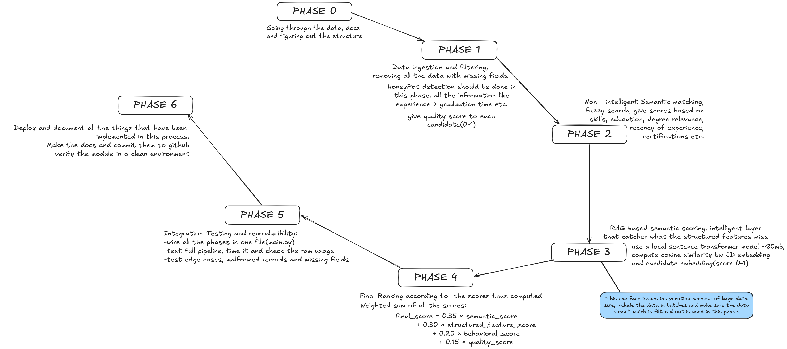

# Intelligent Candidate Discovery & Ranking System

An enterprise-grade, CPU-optimized hybrid scoring and ranking pipeline designed for the **Redrob Intelligent Candidate Discovery & Ranking Challenge**. 

This system processes **100,000 candidate profiles** against a given job description, automatically detects and filters out synthetic/honeypot profiles, scores candidates across multiple dimensions (semantic relevance, structured features, behavioral signals, and profile quality), and returns the **Top 100 best-suited candidates** with detailed reasoning.

---

## Project Phases & Workflow

The system was developed and orchestrated following a structured 7-phase implementation plan:



### Summary of Phases:
* **Phase 0: Research & Data Exploration**: Ingesting raw datasets, analyzing schemas (`candidate_schema.json`, `redrob_signals_doc`), and aligning on weights and schemas.
* **Phase 1: Ingestion & Quality Filtering**: Streamed loading of candidate data to stay within RAM limits. Real-time validation and multi-rule honeypot/synthetic profile detection.
* **Phase 2: Structured Feature Scoring**: Tokenizing skills, calculating experience, education level relevance, recency of roles, certifications, and mapping behavioral signals.
* **Phase 3: RAG-Based Semantic Scoring**: Local vector embeddings generated using a lightweight sentence-transformer model (`all-MiniLM-L6-v2`) to capture deep semantic relevance.
* **Phase 4: Score Fusion & Final Ranking**: Executing a weighted formula to calculate final candidate suitability, sorting, selecting the top 100, and generating deterministic reasoning strings.
* **Phase 5: Integration, Testing & Reproducibility**: Packaging the complete flow into `main.py`, fixing random seeds for 100% determinism, and profiling performance (CPU/RAM/Time).

---

## System Architecture & Hybrid Scoring

To ensure both robustness and deep understanding, the system uses a **multi-signal hybrid scoring pipeline**:

```
[Raw Candidates (100k)] ──> [Ingestion & Honeypot Filtering] (Quality Score)
                                      │
                                      ▼
                        ┌─────────────┴─────────────┐
                        ▼                           ▼
            [Structured Feature Scoring]     [Semantic RAG Scoring]
            - Skills Matching                - Sentence Embeddings
            - Experience & Education         - Cosine Similarity
            - Behavioral Signals             - CPU-optimized Batching
                        │                           │
                        └─────────────┬─────────────┘
                                      ▼
                             [Weighted Score Fusion]
                                      │
                                      ▼
                           [Ranker & CSV Validator]
                                      │
                                      ▼
                            [Top 100 Candidates]
```

### 1. Ingestion & Quality Filtering (Honeypot Detection)
To prevent adversarial/synthetic profiles from skewing results, the ingestion layer evaluates profile sanity:
* **Experience Timeline Sanity Check**: Flagging candidates who claim years of experience exceeding the duration since their graduation.
* **Age vs. Career Contradiction**: Catching profiles where total working experience doesn't align with age.
* **Skill Explosion Check**: Identifying profiles containing unrealistic numbers of skills (e.g. 80+ skills).
* **Deduplication & Career Progression Checks**: Flags junior-to-executive leaps inside short timelines and removes identical profiles.
* Candidates receive a `quality_score` (0-1), and any candidates below a strict threshold are filtered out.

### 2. Structured Feature Scoring
* **Skills Matcher**: Tokenizes job description skills and candidate skills, applying fuzzy matching (`rapidfuzz`) to catch spelling variants (e.g. "ReactJS" vs "React.js").
* **Experience Scorer**: Evaluates required vs. actual years of experience and matches candidate job titles against the target role.
* **Education & Certifications**: Weighs degree level, field relevance, and verified industry certifications.
* **Behavioral Signals**: Maps platform telemetry (completeness, recruiter response rate, interview attendance, offer acceptance) to numeric weights.

### 3. Semantic RAG Scoring
* Employs a local HuggingFace `all-MiniLM-L6-v2` transformer (~80MB) to convert candidate profiles and the job description into vector embeddings.
* **Offline Execution**: Fully local inference—zero external API dependencies (no OpenAI, no Claude).
* **Batch Optimization**: Candidate profile summaries, skills, and titles are processed in batches (e.g., 512 or 1024) to meet CPU execution constraints.

### 4. Score Fusion Formula
The final suitability score is calculated using the following weight distribution:
$$\text{Final Score} = 0.35 \times \text{Semantic Score} + 0.30 \times \text{Structured Feature Score} + 0.20 \times \text{Behavioral Score} + 0.15 \times \text{Quality Score}$$

---

## Performance Constraints & Optimizations

* **Execution Time**: Under **5 minutes** for 100k candidate profiles on standard CPU-only hardware.
  - **Cold Start** (no cached embeddings, includes first-time local model loading and embedding generation for the top 5,000 pre-selected candidates): **~189.8 seconds** (~3 minutes 10 seconds).
  - **Warm Start** (retrieving pre-computed/cached embeddings from `models/`): **~38.8 seconds**.
* **Memory Limits**: Operates within **16 GB RAM** via streaming files and pre-filtering candidate subsets before executing vector search.
* **Determinism**: Random seeds for `numpy` and `random` are fixed to guarantee 100% reproducible rankings.

---

## Setup & Execution (Reproducibility Guide)

This guide provides step-by-step instructions to replicate the pipeline and run tests in a clean virtual environment. 

### 1. Prerequisites & System Requirements
* **Python**: `Python 3.10` or higher (successfully developed and verified on `Python 3.12.3`).
* **Hardware**: Standard x86 or ARM CPU with at least 8 GB RAM (16 GB recommended for 100k candidate scaling).
* **Operating System**: Linux, macOS, or Windows.

### 2. Dependency List & Pinned Versions
The following external libraries are required and pinned inside `requirements.txt` for 100% environment reproducibility:
* `numpy==2.4.6` — Multi-signal vector metrics and array operations.
* `pandas==3.0.3` — Data extraction, manipulation, and CSV generation.
* `scikit-learn==1.9.0` — Similarity and distance metric helpers.
* `sentence-transformers==5.5.1` — Local encoding of text tokens to dense vectors.
* `RapidFuzz==3.14.5` — High-performance token/skill fuzzy matching.
* `faiss-cpu==1.14.3` — Dense vector similarity index search on CPU.
* `orjson==3.11.9` — Ultra-fast, memory-efficient candidate JSONL serialization.
* `pytest==9.0.3` — Test suite execution.

### 3. Setup Virtual Environment
Navigate to the root of the project (`Redrob-Codebase`) and run the commands matching your operating system:

#### On Linux / macOS:
```bash
# 1. Create a virtual environment named 'venv'
python3 -m venv venv

# 2. Activate the virtual environment
source venv/bin/activate

# 3. Upgrade pip to the latest version
pip install --upgrade pip

# 4. Install dependencies
pip install -r requirements.txt
```

#### On Windows (PowerShell or CMD):
```powershell
# 1. Create a virtual environment named 'venv'
python -m venv venv

# 2. Activate the virtual environment
# In PowerShell:
.\venv\Scripts\Activate.ps1
# In Command Prompt (CMD):
.\venv\Scripts\activate.bat

# 3. Upgrade pip
pip install --upgrade pip

# 4. Install dependencies
pip install -r requirements.txt
```

### 4. Data Placement
Ensure that your input data files are located in the `data/` directory:
* **Candidate Pool**: `data/candidates.jsonl`
* **Job Description**: `data/job_description.md`

### 5. Running the Pipeline
With the virtual environment active, run the main entry point:
```bash
python main.py
```
This executes all phases of the pipeline:
1. Loads and parses the input datasets.
2. Runs the fast pre-filters and quality gating.
3. Extracted features on top candidates.
4. Downloads the SentenceTransformer model (`all-MiniLM-L6-v2`) locally to `models/` (first run only, fully cached/offline thereafter).
5. Calculates semantic & domain-concept scores.
6. Computes unified score fusion, sorts the results, and generates custom reasoning.
7. Saves the output to `outputs/submission.csv` (Top 100 candidates) and logs status information.

#### Additional CLI Options:
* Run with a subset of candidates to quickly test system functionality (e.g. 5,000 records):
  ```bash
  python main.py --limit 5000
  ```
* Specify a custom job description or output file:
  ```bash
  python main.py --jd data/job_description.md --output outputs/submission.csv
  ```

### 6. Running Tests
Verify the complete functionality, safety gates, and math logic by running the automated test suite:
```bash
pytest
```
This will automatically discover and run all unit and integration tests inside the `tests/` directory. All tests should report `PASSED`.


